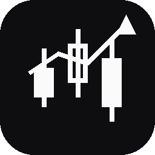
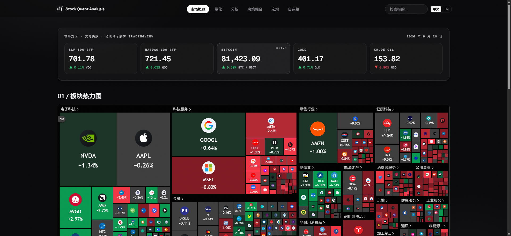
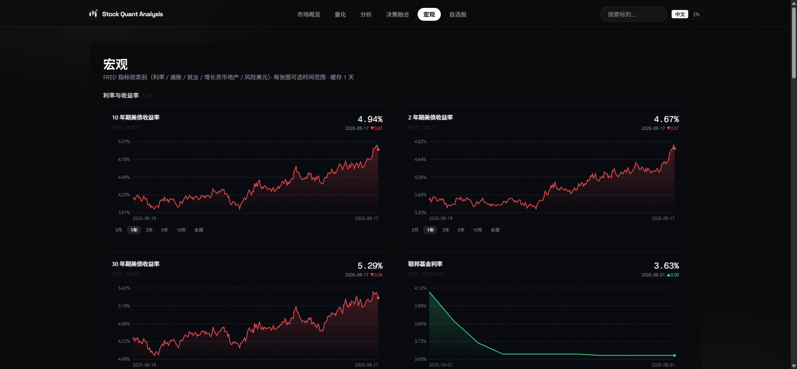
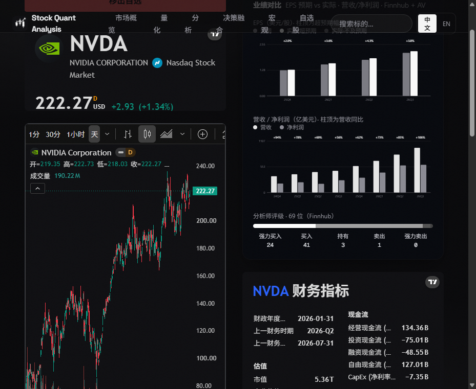
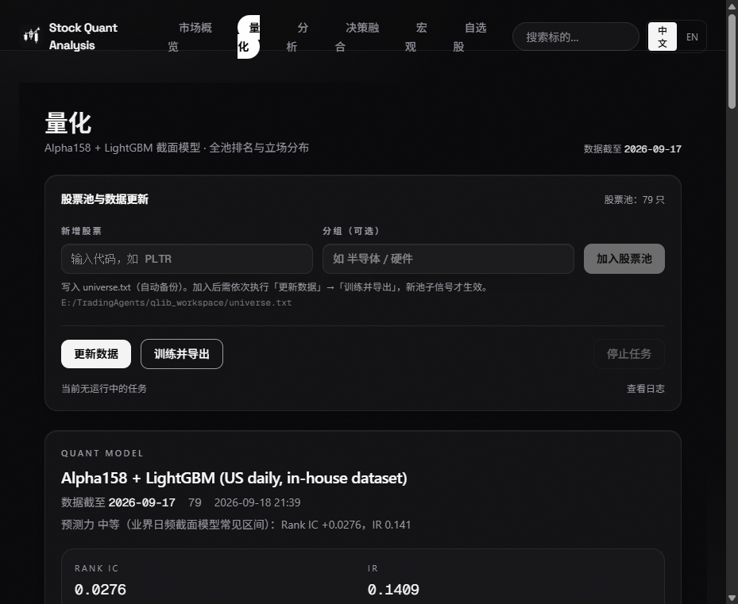

<div align="right">
  <b>简体中文</b> | <a href="./README.en.md">English</a>
</div>

<p align="center">
  
</p>

<h1 align="center">stock-quant-analysis</h1>

<p align="center">
  单机本地运行的开源量化看板：市场概览、个股深度、业绩日历、宏观指标、自选预警，<br/>
  并可选接入本地 qlib + TradingAgents 量化流水线。零数据库、零云依赖、零订阅费。
</p>

<p align="center">
  <a href="https://github.com/xxbond666/stock-quant-analysis/actions/workflows/ci.yml"></a>
  
  
  
  
  
  
  
</p>

<p align="center">
  
</p>

> **免责声明**：本项目为个人研究工具，非券商、非投资顾问。行情数据依提供商规则可能存在延迟；
> 一切输出不构成投资建议。市场有风险，决策需独立。

---

## 📋 目录

1. [✨ 简介](#-简介)
2. [🔋 功能亮点](#-功能亮点)
3. [🖼️ 页面预览](#️-页面预览)
4. [⚙️ 技术栈](#️-技术栈)
5. [📐 架构](#-架构)
6. [🤸 快速开始](#-快速开始)
7. [🔐 环境变量](#-环境变量)
8. [🧱 项目结构](#-项目结构)
9. [📡 数据源与配额策略](#-数据源与配额策略)
10. [🧩 可选：本地量化后端](#-可选本地量化后端)
11. [🎨 设计系统（Mono Glass）](#-设计系统mono-glass)
12. [🌐 国际化](#-国际化)
13. [⚡ 性能](#-性能)
14. [🧪 脚本与工具](#-脚本与工具)
15. [🗺️ 路线图](#️-路线图)
16. [❓ 常见问题与故障排查](#-常见问题与故障排查)
17. [🤝 贡献](#-贡献)
18. [🛡️ 安全](#️-安全)
19. [📜 许可与归属](#-许可与归属)
20. [🙏 致谢](#-致谢)

---

## ✨ 简介

stock-quant-analysis 派生自 [OpenStock](https://github.com/Open-Dev-Society/OpenStock)（AGPL-3.0），
保留其优秀的 UI 基座与 TradingView 组件集成，移除登录/数据库/邮件等重型依赖，
替换为**本地 JSON 存储 + 免费行情 API + 可选本地量化流水线**的轻量架构：

- **零数据库**：自选股与预警存本地 JSON（原子写，断电不坏）
- **零云依赖**：不可也不需部署到 Vercel；设计目标就是 `127.0.0.1` 单机跑
- **免费数据源优先**：Finnhub（主）→ Alpha Vantage（兜底）→ FRED（宏观），全部免费档可用
- **可选量化后端**：本机 `127.0.0.1:6901` 的 Python FastAPI（qlib 信号 + TradingAgents 多智能体报告），
  不部署时相关页面优雅降级，其余功能不受影响

## 🔋 功能亮点

| 模块 | 说明 |
|---|---|
| 📈 封面数据墙 | S&P 500(VOO) / Nasdaq 100(QQQ) / BTC / 黄金 / 原油 五格实时大数字，点击直达 TradingView |
| 🔥 板块热力图 | TradingView SPX500 热力图，中文渲染，整行沉浸 |
| 🗓️ 业绩日历 | 富途式月历：选日期看当日财报，公司 logo + 名称 + 代码 + 盘前/盘后标记，自选池优先 |
| 📰 新闻聚合 | 自选股公司新闻 + 市场头条（TradingView Timeline） |
| 🕯️ 个股详情 | K 线 / 基准对比 / 技术指标 / 财务指标 / 中文公司简介（均为 TradingView 现成组件） |
| 📊 业绩对比图 | EPS 预期 vs 实际分组柱状（超/不及预期着色）+ 营收/净利润柱状 + 分析师评级分布 |
| 🌏 宏观面板 | FRED 5 大类 18 序列：利率/通胀/就业/增长/风险，每卡可选 3 月~全部时间范围，标题跳 TradingView |
| 🧮 量化页 | 模型状态卡、多空榜、全池密集排名表 + **股池专属搜索栏**、股票池维护、训练导出 |
| 🧠 分析控制台 | TradingAgents 多智能体进度时间线（阶段状态/当前步骤/日志），完成后一键打开 PDF 报告 |
| ⚖️ 决策融合 | qlib 截面信号 × TradingAgents 定论，报告 PDF 内联直读 |
| ⭐ 自选与预警 | 自选联动股票池；价格预警 CRUD（触发器在路线图中） |
| 🌗 中英双语 | 页头一键切换，TradingView 组件同步 `zh_CN` |
| ⚡ 秒级导航 | ISR 分级缓存，全站页面 10–80ms 响应 |

## 🖼️ 页面预览

| 市场概览（封面 + 热力图 + 日历） | 宏观（FRED 可交互图表） |
|---|---|
|  |  |
| **个股（业绩对比图）** | **量化（股池搜索 + 排名）** |
|  |  |

## ⚙️ 技术栈

**核心**
- Next.js 15（App Router）+ React 19 + TypeScript 5
- Tailwind CSS v4（`@tailwindcss/postcss`，无 tailwind.config）+ shadcn/ui + Radix UI
- 字体：Space Grotesk（显示）/ Geist（正文）/ Geist Mono（数字），`next/font` 构建期自托管

**数据与集成**
- Finnhub（搜索兜底 / 报价 / 新闻 / 业绩日历 / EPS）
- Alpha Vantage（季度利润表，24h 落盘缓存）
- FRED（宏观序列）
- TradingView 嵌入式组件（图表 / 热力图 / 简介 / 财务 / 技术分析）
- 可选：本地 Python FastAPI（qlib + TradingAgents + OpenBB 数据层）

**存储与运行时**
- 本地 JSON（自选 / 预警 / 缓存），原子写 + `.bak` 备份
- 无数据库、无消息队列、无后台服务依赖

## 📐 架构

```
浏览器（仅访问 :3000）
   │
   ▼
Next.js 15 服务端（server actions 作代理层，ISR 分级缓存）
   ├── 本地 JSON 存储 ............ 自选 / 预警 / 名称表 / 营收缓存
   ├── Finnhub / Alpha Vantage / FRED ....... 免费行情与宏观
   ├── TradingView widgets ..... 图表 / 热力图 / 简介（浏览器直连，可配代理）
   └── 127.0.0.1:6901（可选）.... Python 量化控制台
            ├── /api/quant/{signals,decisions}   qlib 信号与融合
            ├── /api/qlib/{universe,signal,run}  股票池与训练
            ├── /api/analysis/*                  TradingAgents 任务
            └── 报告 → {TA_REPORTS_DIR}/{run}/complete_report.pdf
                         ▲
                         └── /api/report/{name} 内联直读（防目录穿越）
```

安全边界：浏览器**永不直连 6901**（零鉴权端口）；看板默认仅绑 `127.0.0.1`。详见 [SECURITY.md](./SECURITY.md)。

## 🤸 快速开始

**前置条件**
- Node.js ≥ 18.18（推荐 20+）
- 一个免费 Finnhub key（其余 key 全部可选）
- Windows 用户可获得一键启动与桌面应用窗口；Linux/macOS 直接 `npm start`

**安装与运行**

```bash
git clone https://github.com/xxbond666/stock-quant-analysis.git
cd stock-quant-analysis
npm install

# 配置：复制模板，至少填入 Finnhub key
cp .env.example .env.local     # Windows PowerShell: Copy-Item .env.example .env.local

npm run build
npm start                      # 仅监听 127.0.0.1:3000
```

打开 http://127.0.0.1:3000 即可。

**Windows 增强（可选）**

```powershell
.\scripts\start_all.ps1            # 自检 + 启动 + 桌面应用窗口（app-mode）
.\scripts\start_all.ps1 -NoBrowser # 无人值守
node scripts/check-env.mjs         # 环境变量 + 后端连通性自检
python scripts/make_desktop_shortcut.py   # 重建桌面快捷方式（需 pip install pylnk3）
python scripts/make_logo.py        # 再生成应用图标（需 pip install Pillow）
```

**构建说明**
- 构建期 `next/font` 需一次性联网拉取 Google Fonts 并自托管；离线环境见故障排查
- 某些地区浏览器直连 TradingView 不通：设置用户环境变量 `DASH_PROXY=http://127.0.0.1:7897`（任意代理）后重启启动脚本

## 🔐 环境变量

完整模板见 [.env.example](./.env.example)。摘要：

| 变量 | 必填 | 用途 | 免费申请 |
|---|---|---|---|
| `NEXT_PUBLIC_FINNHUB_API_KEY` | ✅ | 搜索兜底 / 报价 / 新闻 / 业绩日历 / EPS | [finnhub.io](https://finnhub.io/register) |
| `ALPHA_VANTAGE_API_KEY` | ❌ | 季度营收/净利润（25 次/日，24h 落盘缓存） | [alphavantage.co](https://www.alphavantage.co/support/#api-key) |
| `FRED_API_KEY` | ❌ | 宏观页 18 序列 | [fred.stlouisfed.org](https://fred.stlouisfed.org/docs/api/api_key.html) |
| `QUANT_API_BASE` | ❌ | 本地量化控制台地址（默认 `http://127.0.0.1:6901`） | — |
| `TA_REPORTS_DIR` | ❌ | TradingAgents 报告根目录（默认 `./data/reports`） | — |
| `QLIB_UNIVERSE_PATH` | ❌ | 股票池 universe.txt（默认 `./data/universe.txt`） | — |
| `APP_STATE_PATH` / `APP_DATA_DIR` | ❌ | 状态文件 / 数据根目录（默认 `./data`） | — |

脚本用系统环境变量（不读 `.env`）：`DASH_PROXY`（浏览器代理）、`DASH_WATCHDOG_PS`（6901 守护脚本路径）。

## 🧱 项目结构

```
app/
  (root)/
    page.tsx                 市场概览（封面数据墙 + 热力图 + 新闻 + 业绩日历）
    stocks/[symbol]/page.tsx 个股详情（TV 组件 + 业绩对比图）
    quant/  analysis/  decisions/  macro/  watchlist/
  api/
    report/[name]/route.ts   本地报告 PDF 直读（白名单 + 根目录校验）
    logo/[symbol]/route.ts   Finnhub logo 代理（内存缓存）
components/
  home/        CoverStats（数据墙）、EarningsCalendarCard（富途式月历）、WatchlistNews
  charts/      SvgCharts（零依赖折线/分组柱状）
  macro/       MacroPanels（时间范围可选）
  quant/       SignalTable（股池搜索）、QuantTools、QuantPanels
  analysis/    AnalysisConsole（进度时间线）
lib/
  config.ts    本地路径统一出口（env 可覆盖）
  actions/     server actions（finnhub / av / fred / 日历 / 自选 / 股票池）
  quant/api.ts 6901 访问层（超时 + 20s 缓存）
  i18n/        中英字典与切换
scripts/       start_all.ps1 / check-env.mjs / make_logo.py / make_desktop_shortcut.py
docs/screenshots/
```

## 📡 数据源与配额策略

| 领域 | 主源 | 兜底 | 缓存 |
|---|---|---|---|
| 封面报价 / 搜索 / 新闻 / 日历 / EPS | Finnhub（60 req/min） | Alpha Vantage | 报价 60s / 新闻 15min / 日历 6h / 名称表 7d |
| 季度营收 / 净利润 | Alpha Vantage（25 req/日） | —（优雅降级） | 24h 落盘 |
| 宏观 18 序列 | FRED | — | 1d |
| 图表 / 热力图 / 简介 / 财务 | TradingView widgets | — | 浏览器侧 |
| qlib 信号 / 融合 / 报告 | 本地 6901 | —（优雅降级） | 20s |

**已知配额陷阱**（均已规避）：AV 免费档耗尽时返回 HTTP 200 + `Note/Information` JSON；
Finnhub 日历单次上限 1500 条且只保留时间靠后一端（故按 14 天分窗拉取）；FRED `limit` 上限 100000。

## 🧩 可选：本地量化后端

量化 / 分析 / 决策三页依赖一个**外部可选**的 Python FastAPI 服务（默认 `127.0.0.1:6901`），
提供 qlib 截面信号、股票池训练、TradingAgents 多智能体分析与报告。接口契约见 [API_DOCS.md](./API_DOCS.md)。

- 不部署它：三页显示琥珀色连接面板（含 `curl` 自检命令），**其余功能完全正常**
- 部署它：报告 PDF 经 `/api/report/{name}` 内联打开；分析页提供阶段级进度时间线

## 🎨 设计系统（Mono Glass）

- **单色 chrome**：炭黑底 `#08080a` + 六级冷灰 + 毛玻璃面板（blur 14px + 1px 内描边 + 单光源染色阴影）
- **数据语义色**：涨 `#35D07F` / 跌 `#E5484D`（仅数据，不用于 chrome）；白 = 激活态
- **字体**：Space Grotesk 显示 / Geist 正文 / Geist Mono 数字（全局 `tabular-nums`）
- **氛围**：固定白晕光斑 + 2.8% 胶片颗粒覆层；spotlight 悬停边框
- **交互**：200ms 过渡、按压 `scale(.98)`、可见焦点环；骨架屏加载态

## 🌐 国际化

- 页头「中文 / EN」一键切换（cookie 持久化）
- TradingView 组件统一 `locale: zh_CN`（含热力图 / 简介 / 财务 / 技术分析）
- 新增文案请同时补 `lib/i18n/messages.ts` 双语字典

## ⚡ 性能

| 页面 | ISR 缓存 | 实测响应 |
|---|---|---|
| `/` 市场概览 | 60s | ~25ms |
| `/quant` `/decisions` | 20s | ~10–15ms |
| `/stocks/[symbol]` | 5min | ~12ms |
| `/macro` | 1h | ~80ms |
| `/watchlist` | 60s | ~12ms |

配合 Next `<Link>` 预取，点击导航体感即时；外部 API 调用全部服务端发生并分层缓存。

## 🧪 脚本与工具

| 命令 | 说明 |
|---|---|
| `npm run dev` | 开发服务器（Turbopack） |
| `npm run build` | 生产构建（Turbopack） |
| `npm start` | 生产服务器（`-H 127.0.0.1`） |
| `npm run typecheck` | `tsc --noEmit` |
| `npm run lint` | ESLint |
| `npm test` | Vitest |
| `node scripts/check-env.mjs` | 环境变量 + 后端连通性自检 |
| `scripts/start_all.ps1` | Windows 一键启动（自检 + 应用窗口） |

CI（GitHub Actions）在每个 push/PR 上跑 typecheck → lint → test → build。

## 🗺️ 路线图

- [ ] 价格预警触发器（本地轮询 + 桌面通知）
- [ ] 业绩日历订阅导出（.ics）
- [ ] 宏观序列自定义组合与对比图
- [ ] 报告全文检索（本地 PDF 索引）
- [ ] 英文界面文案润色与贡献者指南细化

## ❓ 常见问题与故障排查

- **安装依赖慢**：仓库不锁 registry；中国大陆用户可 `npm config set registry https://registry.npmmirror.com`
- **npm 提示 allow-scripts / sharp 待批准**：新版 npm 脚本审批提示，可忽略或 `npm approve-scripts`
- **构建期字体下载失败**：`next/font` 需一次性联网；离线请先在有网机器构建，或临时注释 `app/layout.tsx` 中 `Space_Grotesk`
- **TradingView 组件空白**：网络直连不通，设 `DASH_PROXY` 后重启（见快速开始）
- **端口占用**：`npm start -- -p 3001`
- **零配置空态**：未填 key 时各页显示带指引的空态（见 `.env.example` 注释），不会崩溃
- **Windows 专属**：`start_all.ps1` / `dashboard_window.pyw` 仅 Windows；其他平台用 `npm start`

## 🤝 贡献

欢迎 Issue 与 PR：

1. Fork 并创建特性分支
2. 保持 PR 聚焦；UI 变更附截图
3. 跑过 `typecheck / lint / test` 再提交
4. 新增用户可见文案请补双语字典

## 🛡️ 安全

本项目为**本地单用户**设计：默认仅绑 `127.0.0.1`，部分端点无鉴权（有意为之）。
请勿公网裸奔；若需网络访问请自行加前置鉴权。漏洞报告方式见 [SECURITY.md](./SECURITY.md)。

## 📜 许可与归属

本目录代码派生自 [OpenStock](https://github.com/Open-Dev-Society/OpenStock)（© Open Dev Society，AGPL-3.0），
上游原文说明保留在 [README.upstream.md](./README.upstream.md)。依 AGPL-3.0，本派生作品同证授权；
若对外提供网络访问，需公开本目录全部源码并署名原作者。

**相对上游的修改声明（AGPL §5）**
- 移除：登录/认证（Better Auth + MongoDB）、邮件/后台任务（Inngest + Nodemailer）、情绪卡（Adanos）、
  上游搜索实现、Dockerfile、`.idea`、肖像图标（换为 `scripts/make_logo.py` 生成的原创几何图标）
- 替换：数据库 → 本地 JSON（原子写）；搜索 → 本地股票池优先 + Finnhub 兜底（带超时）
- 新增：量化/分析/决策/宏观四页、业绩日历（Finnhub 分窗）、封面数据墙、Mono Glass 设计系统、
  ISR 性能分层、报告 PDF 直读、股池搜索、`.env.example` / `SECURITY.md` / CI
- 修改时间：2026-09

## 🙏 致谢

- [Open Dev Society](https://github.com/Open-Dev-Society) 与 OpenStock 全体贡献者——优秀的 UI 基座
- [TradingView](https://www.tradingview.com/) 嵌入式组件 / [Finnhub](https://finnhub.io/) / [Alpha Vantage](https://www.alphavantage.co/) / [FRED](https://fred.stlouisfed.org/) 免费数据
- shadcn/ui、Radix UI、Tailwind CSS、Next.js 社区

— 本地运行，永远免费，永远开源。
